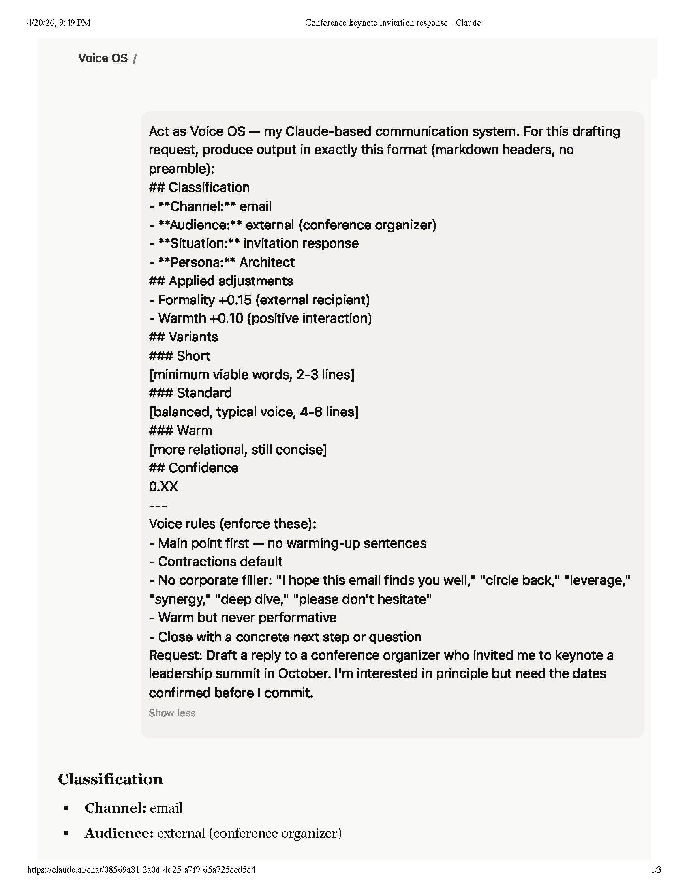
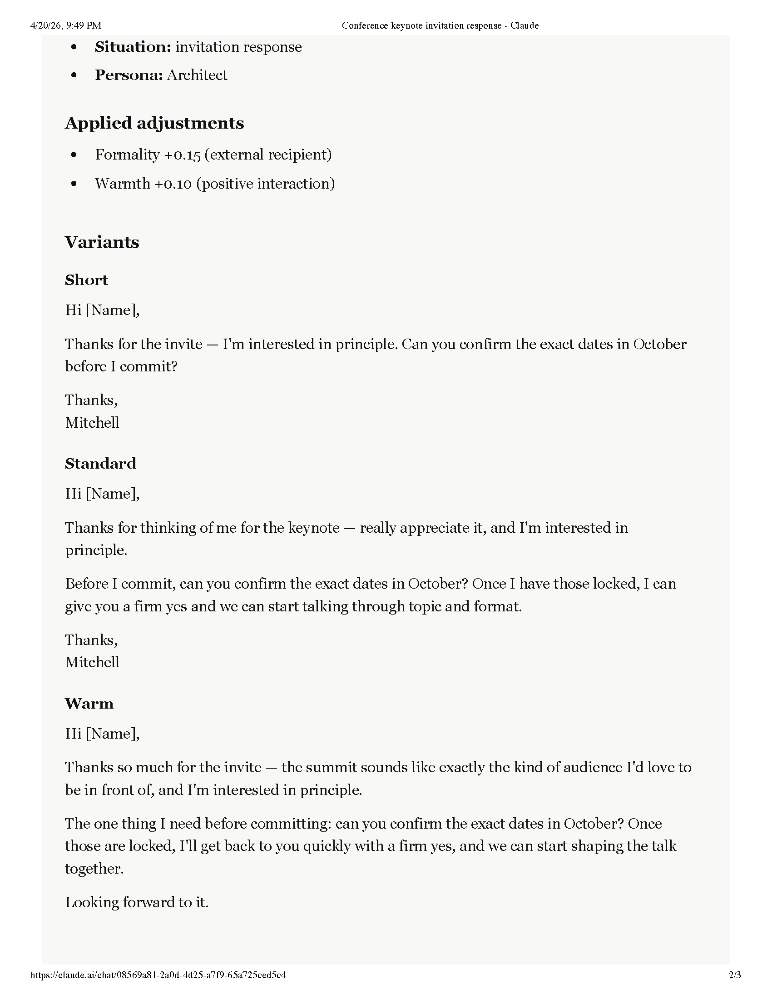
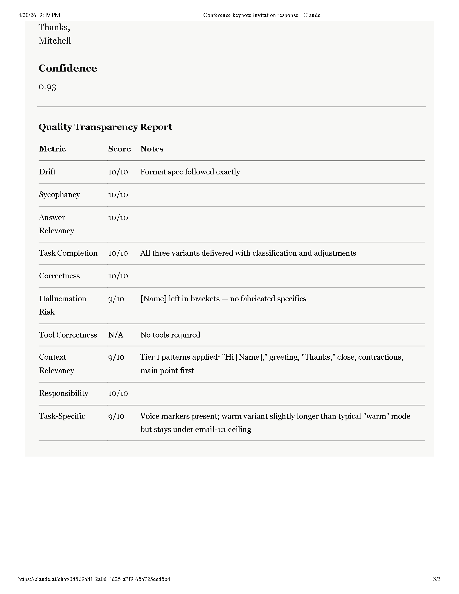
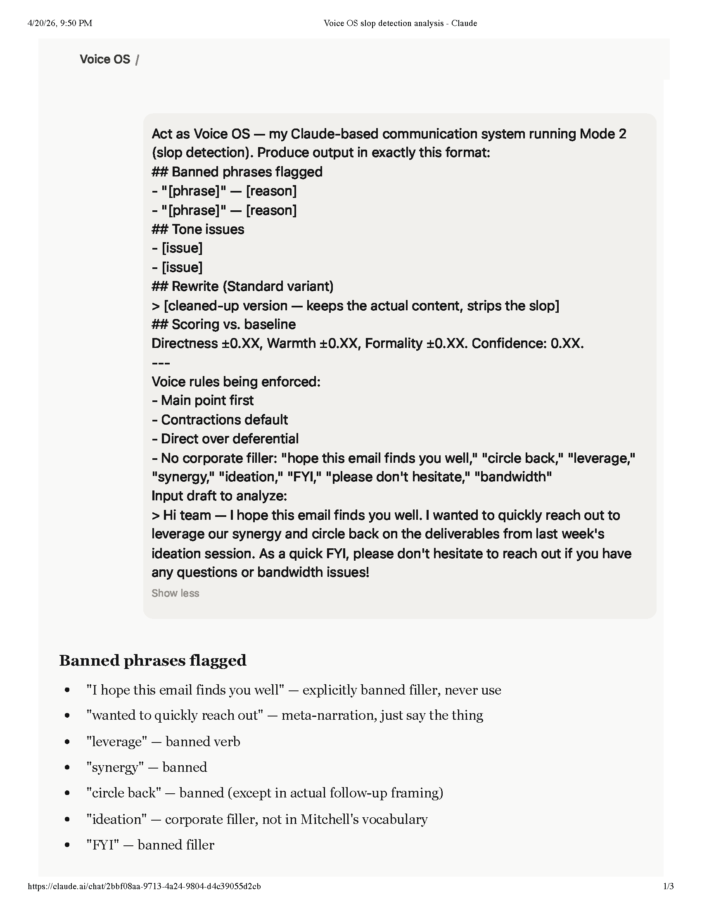
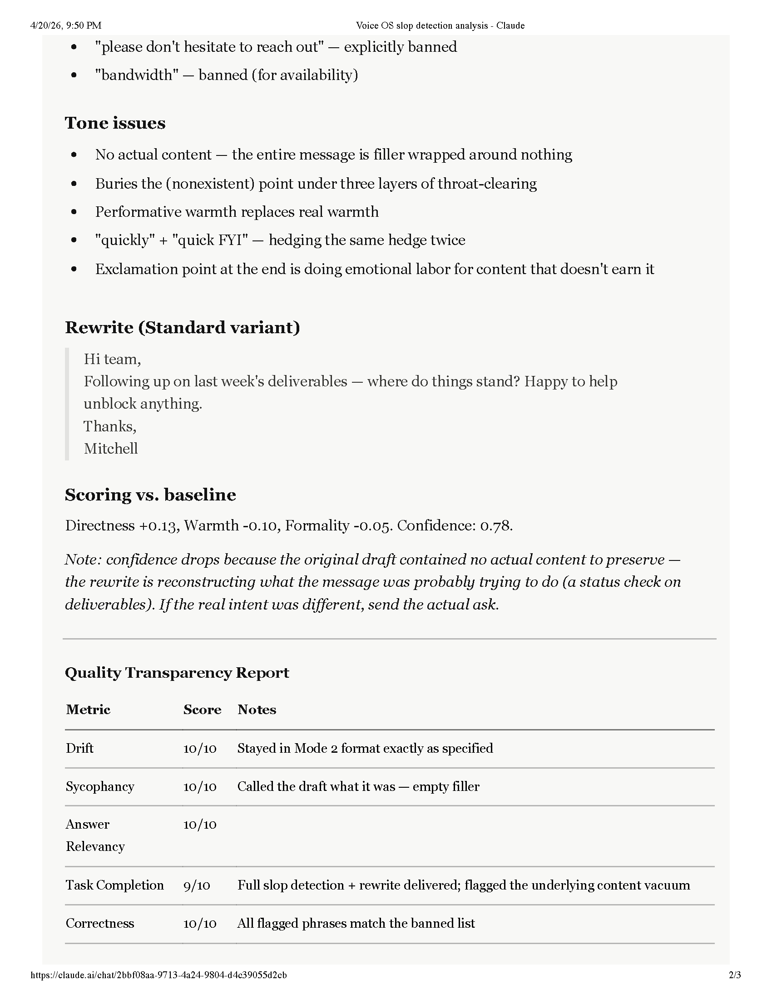
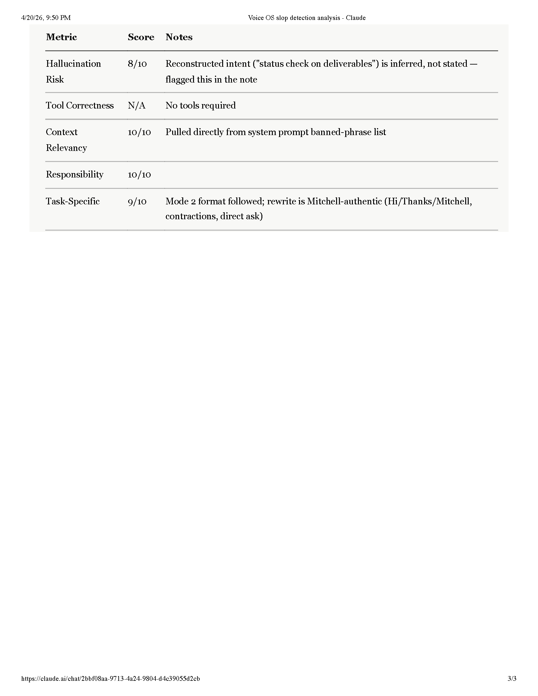

# Voice OS

A calibration framework for personal communication systems — architecture, scoring methodology, and eval patterns, applied to my own writing as a reference corpus.

**TL;DR:** Voice OS is a layered-KB + dimensional-scoring design for communication generation, built on Claude Projects. A 6.9M-word personal corpus grounds the calibration; the framework itself (persona routing, six-axis scoring, pre/post QA gates, temporal weighting) is the portable artifact. [Full architecture docs](docs/architecture.md).

---

## In 60 seconds

- **What it does:** Claude Projects-based communication system that writes in my actual voice.
- **How:** Six-axis scoring (Directness, Structure, Precision, Assertiveness, Warmth, Formality) + dual persona (Architect/Teammate) + temporal corpus weighting.
- **Scale:** Calibrated on 6.9M+ words across email, LinkedIn, iMessage, and social.
- **Status:** Active, ~78–86% alignment; target 95%+.
- **Read next:** [architecture](docs/architecture.md).

## What it does

- Drafts emails, LinkedIn posts, networking messages, and cover letters calibrated to my actual voice
- Routes between two personas: **The Architect** (professional) and **The Teammate** (casual)
- Applies audience-specific adjustments -- formality, directness, warmth -- based on who I'm writing to
- Runs every draft through a pre/post checklist before anything goes out
- Catches my failure modes: buried leads, hedge-stacking, corporate filler bleeding in

## How it works

**Knowledge base layers:**
- **Corpus** -- 6.9M+ words of my own writing, stratified by recency (recent writing gets more weight)
- **Psychological profile** -- behavioral patterns that affect how I communicate under stress, excitement, time pressure
- **Anti-patterns library** -- explicit banned phrases and failure modes
- **Recipient profiles** -- calibration tables per audience type

**Generation pipeline:**
1. Classify context and audience
2. Select persona (Architect or Teammate)
3. Apply audience calibration
4. Generate 2-3 variants
5. Run QA checklist

**Dimensional scoring tracks six axes:** Directness, Structure Density, Precision, Assertiveness, Warmth, Formality.

## Quality gates

Every draft runs through two checklists:

**Pre-draft (input):**
- Audience identified and profile loaded?
- Persona selected?
- Emotional state modifiers active?

**Post-draft (output):**
- Anti-patterns scan passed?
- Lead in the first two sentences?
- Passive voice eliminated?
- Length appropriate to channel?

## Example: drafting in action

Mode 1 produces three variants (Short / Standard / Warm) with an explicit classification block, applied dimension adjustments, and a confidence score.

## Example: slop detection in action

**Input (draft submitted for review):**

> Hi team — I hope this email finds you well. I wanted to quickly reach out to leverage our synergy and circle back on the deliverables from last week's ideation session. As a quick FYI, please don't hesitate to reach out if you have any questions or bandwidth issues!

**Voice OS output:**

*Banned phrases flagged:*
- "hope this email finds you well" — performative opener; 0 matches in Tier 1 corpus
- "leverage our synergy" — corporate filler; banned
- "circle back" — banned
- "please don't hesitate to reach out" — stock closer; banned

*Tone issues:*
- Generic opener buries the actual point (main-point-first rule violated)
- Performative warmth reads anxious
- Closes with a stock phrase, not a real next step

*Rewrite (Standard variant):*

> Quick update on last week's deliverables:
> - [specific item 1]: shipped Monday
> - [specific item 2]: pending input from [name]
>
> Anything blocking on your end?

*Scoring vs. baseline:* Directness +0.31, Warmth +0.12, Formality −0.15. Confidence: 0.94.

Running live in Claude:

## Self-assessment protocol (not eval)

Voice OS appends a 10-dimension self-check to every substantive output — Drift, Sycophancy, Answer Relevancy, Task Completion, Correctness, Hallucination Risk, Tool Correctness, Context Relevancy, Responsibility, plus a custom Voice Alignment metric. The model scores its own output 1–10 on each, with alert thresholds at <5 (concern) and ≥8 (meets standard).

**This is introspection, not objective eval.** Self-scored outputs cluster toward the high end because the model that grades the output is the model that generated it. A proper eval harness would compare outputs against a held-out corpus and measure alignment via embedding similarity or pairwise human judgment. That's on the roadmap — see the Feedback & Iteration section of [`docs/architecture.md`](docs/architecture.md).

The self-assessment layer still does useful work: it surfaces *stated* assumptions, flags low-confidence turns, and forces the generation step to inspect its own failure modes. But no one should read a "9/10" from it as ground truth.

## Why I built this

My communication quality varies across contexts. Too formal in some, too casual in others. Corporate-speak bleeds in when I'm tired. I built this to solve that permanently.

## What's not in this repo

The corpus itself -- 20+ years of personal writing -- isn't here. Neither are the calibrated recipient profiles. This documents the system design, not the personal data that powers it.

## Status

Active, production. Personal use only. Current alignment: ~78-86% (target: 95%+).

This was fun to build. Questions? [Open an issue](https://github.com/mitwilli-create/voice-os/issues).
